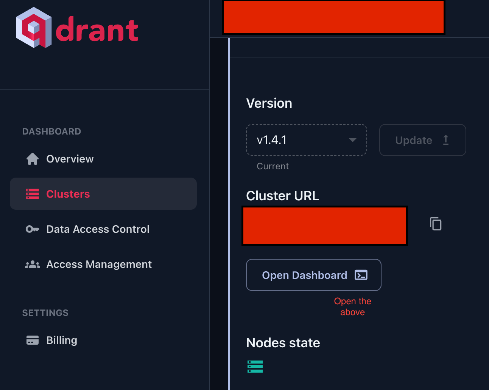

[](https://www.resumematcher.fyi)

# Job Genie - AI-Powered Resume Optimizer

🚀 **AI-Powered Resume Enhancement** • 📊 **ATS Optimization** • 🎯 **Smart Job Matching** • 🔍 **Real-Time Analysis**

---

### Job Genie is an AI-powered resume optimization tool that uses advanced NLP and machine learning to tailor your resume to job descriptions, ensuring maximum ATS compatibility and hiring success.

</div>

<br>

<div align="center">


**Don't let your resume be a roadblock from getting your next job. Use Job Genie!**


## 🎯 Key Features

</div>

✨ **Advanced ATS Optimization** - Smart keyword extraction and placement
🤖 **AI-Powered Analysis** - Deep learning resume scoring and recommendations  
📊 **Real-Time Feedback** - Instant optimization suggestions as you upload
🎨 **Professional Formatting** - Clean, ATS-friendly resume templates
🔍 **Keyword Matching** - Intelligent job description analysis
📈 **Score Tracking** - Monitor your resume's performance metrics
🚀 **Export Options** - Download optimized resumes in multiple formats

<br/>

## 🛠 How It Works

The Job Genie uses cutting-edge AI to analyze your resume against job descriptions:

1. **📄 Smart Parsing**: Advanced PDF processing extracts text, formatting, and structure
2. **🧠 AI Analysis**: NLP algorithms identify key skills, experiences, and qualifications  
3. **🎯 Job Matching**: Vector similarity matching against job requirements
4. **📊 ATS Scoring**: Real-time compatibility scoring with hiring systems
5. **✨ Optimization**: Intelligent keyword suggestions and formatting improvements
6. **📈 Performance Tracking**: Monitor improvements across multiple applications

<br/>

## 🚀 Quick Start

### Prerequisites
- Python 3.10 or higher
- Git

### Installation

1. **Clone the repository**
   ```bash
   git clone https://github.com/your-username/Job-Genie.git
   cd Job-Genie
   ```

2. **Create virtual environment**
   ```bash
   python -m venv venv
   ```

3. **Activate virtual environment**
   
   **Windows:**
   ```bash
   venv\Scripts\activate
   ```
   
   **macOS/Linux:**
   ```bash
   source venv/bin/activate
   ```

4. **Install dependencies**
   ```bash
   pip install -r requirements.txt
   ```

5. **Run the application**
   ```bash
   streamlit run streamlit_app.py
   ```

6. **Open your browser** to `http://localhost:8501`

<br/>

## 📁 Project Structure

```
Job-Genie/
├── streamlit_app.py          # Main Streamlit application
├── requirements.txt          # Python dependencies
├── scripts/                  # Core processing modules
│   ├── ResumeProcessor.py   # Resume parsing and analysis
│   ├── JobDescriptionProcessor.py  # Job description processing
│   ├── similarity/          # Similarity scoring algorithms
│   └── utils/               # Utility functions
├── Data/                    # Data storage
│   ├── Resumes/            # Upload your resume PDFs here
│   ├── JobDescription/     # Upload job description PDFs here
│   └── Processed/          # Processed JSON outputs
└── Assets/                 # Static assets and images
```

<br/>

## 💡 Usage Guide

### 1. Upload Documents
- Place your resume (PDF) in `Data/Resumes/`
- Add job descriptions (PDF) in `Data/JobDescription/`

### 2. Run Analysis
```bash
streamlit run streamlit_app.py
```

### 3. View Results
- ATS compatibility score
- Keyword optimization suggestions
- Skills gap analysis
- Formatting recommendations

### 4. Optimize & Export
- Apply suggested improvements
- Download optimized resume
- Track performance improvements

<br/>

## 🔧 Advanced Configuration

### Environment Variables
Create a `.env` file for API keys and configurations:
```env
COHERE_API_KEY=your_cohere_api_key_here
QDRANT_HOST=localhost
QDRANT_PORT=6333
```

### Docker Deployment
```bash
docker-compose up -d
```
Access at `http://localhost:8501`

<br/>

## 🧪 Technology Stack

- **Frontend**: Streamlit
- **Backend**: Python, FastAPI
- **AI/ML**: spaCy, NLTK, FastEmbed, Cohere
- **Vector DB**: Qdrant
- **PDF Processing**: PyPDF2, pypdf
- **Data Processing**: Pandas, NumPy
- **Visualization**: Plotly, Matplotlib

<br/>

## 📊 Performance Metrics

Job Genie helps you track:
- **ATS Compatibility Score** (0-100%)
- **Keyword Match Rate** 
- **Skills Coverage** percentage
- **Readability Score**
- **Format Compliance** rating

<br/>

## 🔒 Privacy & Security

- **Local Processing**: All data processed locally
- **No Data Storage**: Files processed temporarily
- **Secure Uploads**: Encrypted file handling
- **Privacy First**: No personal data collection

### Cohere and Qdrant

1.  Visit [Cohere website registration](https://dashboard.cohere.ai/welcome/register) and create an account.
2.  Go to API keys and copy your cohere api key.
3.  Visit [Qdrant website](https://cloud.qdrant.io/) and create an account.
4.  Get your api key and cluster url.
5.  Go to open dashboard in qdrant and enter your api key **for only the first time**

1.  Now create a yaml file named config.yml in Scripts/Similarity/ folder.

## 🤝 Contributing

We welcome contributions! Here's how you can help:

### Development Setup
1. **Fork** the repository
2. **Clone** your fork
3. **Create** a feature branch
4. **Make** your changes
5. **Test** thoroughly
6. **Submit** a pull request

### Code Standards
- Follow [Black](https://black.readthedocs.io/) code formatting
- Use meaningful commit messages
- Add tests for new features
- Update documentation as needed

### Pre-commit Hooks
```bash
pip install pre-commit
pre-commit install
```

### Ways to Contribute
- 🐛 **Bug Reports** - Found an issue? Let us know!
- 💡 **Feature Requests** - Have an idea? Share it!
- 📝 **Documentation** - Help improve our docs
- 🧪 **Testing** - Add test coverage
- 🎨 **UI/UX** - Enhance the user experience

<br/>

## 📝 License

This project is licensed under the MIT License - see the [LICENSE](LICENSE) file for details.

<br/>

## 🆘 Support

- 📖 **Documentation**: Check our comprehensive guides
- 💬 **Community**: Join our Discord for real-time help
- 🐛 **Issues**: Report bugs on GitHub
- � **Feature Requests**: Suggest improvements

<br/>

## � Roadmap

### Current Focus
- ✅ Core ATS optimization engine
- ✅ Real-time scoring system
- ✅ PDF processing pipeline
- 🔄 Enhanced AI analysis
- � Multi-format export options

### Coming Soon
- 🔜 **Resume Templates** - Professional, ATS-friendly designs
- 🔜 **Job Board Integration** - Direct job matching
- 🔜 **Interview Prep** - AI-powered interview questions
- 🔜 **Career Insights** - Industry trend analysis
- 🔜 **Mobile App** - On-the-go optimization

### Future Vision
- 🌟 **AI Interview Coach** - Practice with AI
- 🌟 **Network Analysis** - LinkedIn integration
- 🌟 **Salary Insights** - Market rate analysis
- 🌟 **Skills Roadmap** - Career development paths

<br/>

---

<div align="center">

### 🚀 Ready to Optimize Your Resume?

**Transform your job search with AI-powered resume optimization**

[Get Started](#-quick-start) • [View Demo](https://resume-matcher.streamlit.app/) • [Join Community](https://discord.gg/t3Y9HEuV34)

---

**Made with ❤️ by the Job Genie team and contributors worldwide**

[](https://github.com/your-username/Job-Genie/stargazers)
[](https://twitter.com/your-twitter)

</div>
